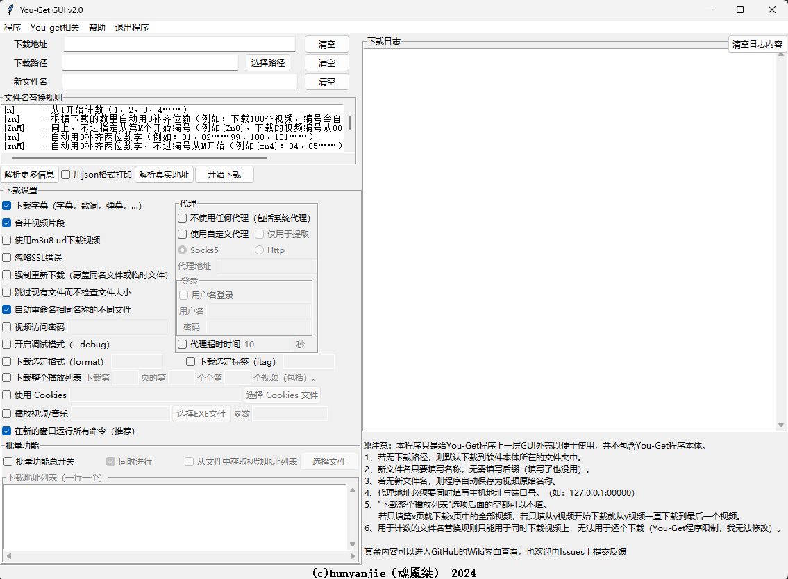
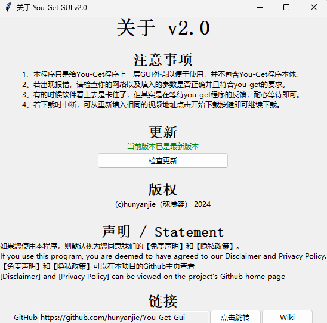
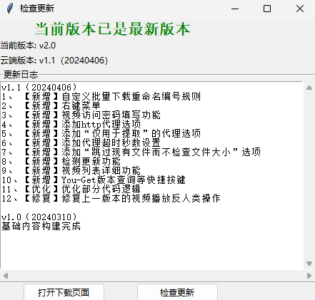
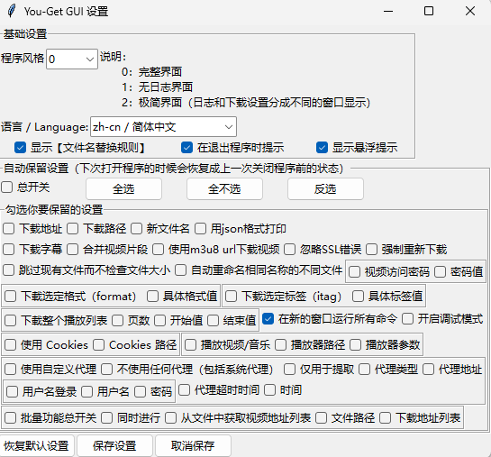
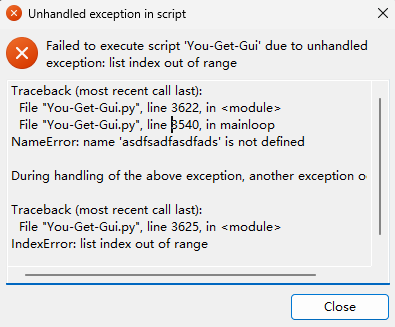
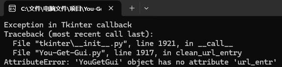

# 关于本程序（About）

给You-Get套上GUI以便于使用。

You-Get hooked up to a GUI for easy use.

# 免责声明（Disclaimer）

**本软件【You-Get GUI】（以下简称"软件"）由hunyanjie（魂魇桀）开发，并根据MIT License进行授权。本程序仅供学习交流使用。在使用本软件之前，请仔细阅读以下免责声明。**

***责任限制***：软件“按原样”提供，不附带任何形式的明示或暗示保证，包括但不限于适销性、特定用途的适用性以及非侵权性保证。在任何情况下，作者或版权持有人不对任何索赔、损害或其他责任负责，无论是合同行为、侵权行为或其他行为，因软件或软件的使用或其他交易而产生的。

***用户责任***：用户应自行承担使用软件的风险。在使用、修改或分发软件的过程中，用户应遵守相关法律法规，包括但不限于版权法、隐私法和数据保护法。用户不得利用软件进行任何非法活动，包括但不限于侵犯版权、隐私权或其他第三方权利。

***法律遵守***：用户在使用软件时，必须遵守所在地的法律和政府规章制度。用户应自行判断软件是否符合其使用目的，并确保其使用方式不违反任何法律、法规或政策。

***修改和分发***：用户可以自由修改和分发软件，但必须保留本免责声明和MIT License中的版权声明。任何修改后的软件版本也应包含此免责声明，并明确指出修改的内容。

***免责声明的变更***：作者保留随时修改本免责声明的权利，用户应定期查看以获取最新版本。

# 隐私政策（Privacy Policy）

生效日期： **2024/6/26**

1. 引言 

    本隐私政策阐述了【You-Get GUI】（以下简称“我们的”、“我们”或“程序”）如何收集、使用、保护和共享您的信息。我们重视您的隐私，并致力于保护您的个人信息。

2. 信息收集

    我们的程序仅在以下情况下自动尝试联网：

    - 当用户打开【关于】窗口时，以获取程序的版权和版本信息。

    - 当用户打开【检查更新】窗口时，以获取最新程序的版本号和更新内容。

    在上述情况下，程序将与更新服务器进行通信，但不会收集任何个人身份信息。

    我们的程序在以下情况下收集信息：

    - 用户通过程序界面输入的需求，这些需求将被转化为命令行指令。

    - 当用户选择执行下载操作时，程序将生成相应的cmd命令。

3. 信息使用

    我们使用收集的信息来：

    - 显示程序的版本信息。

    - 检查并提示用户程序的更新情况。

    - 执行用户通过程序界面提出的下载请求。

    - 与第三方工具you-get交互，以完成用户的下载任务。

4. 第三方工具交互

    我们的程序通过生成cmd命令与you-get工具交互。我们不直接与you-get共享任何用户数据，但请注意，you-get可能有自己的隐私政策，我们建议您查阅you-get的隐私政策以了解其数据处理方式。

5. 本地数据存储

    如果用户启用了【自动保留设置】功能，程序将在每次关闭时自动保存用户的设置到本地。这些数据仅用于恢复用户的个性化设置，并不会被上传或共享。

6. 更新和下载

    程序会提示用户有关更新的信息，并可能提供指向GitHub下载页面的链接。用户是否选择下载和更新完全基于自愿，我们不会强制要求用户进行更新。

7. 隐私政策的更改

    我们可能会不时更新本隐私政策。任何重大更改将通过程序更新通知用户。

# 安装/更新 You-Get（Install/Update You-Get）
安装you-get库
Install the you-get library

```
pip install you-get
```

更新you-get库
Update the you-get library

```
pip install --upgrade you-get
```

# 注意事项（Notes）

## 中文

1. 请确保您已经安装了Python和pip。
2. 本程序只是给You-Get程序上一层GUI外壳以便于使用，并不包含You-Get程序本体。 
3. 若无下载路径，则默认下载到"C:/Users/[用户名]"文件夹中。
4. 程序支持自定义显示语言，其他国家的用户可以自行翻译并配置。

## 英文

1. Make sure you have Python and pip installed.
2. This program only gives You-Get program a layer of GUI shell for easy use, and does not contain You-Get program ontology.
3. If there is no download path, the file is downloaded to the C:/Users/[User name] folder by default.
4. The program supports custom display language, and users in other countries can translate and configure it by themselves.

# You-Get GUI使用介绍（You-Get GUI Introduction）

## 关于本程序（About）

给You-Get套上GUI以便于使用。


[B站视频（Bilibili Video Link）](https://www.bilibili.com/video/BV15x4y1S7dJ)

软件开源地址：[https://github.com/hunyanjie/You-Get-Gui](https://github.com/hunyanjie/You-Get-Gui)

下载地址：[https://github.com/hunyanjie/You-Get-Gui/releases/](https://github.com/hunyanjie/You-Get-Gui/releases/)

## 安装（Install）
### 准备

安装前需要准备的文件下载地址
Python官方网址：[https://www.python.org/downloads/](https://www.python.org/downloads/)

Python 安装程序镜像网址：[https://mirrors.huaweicloud.com/python/](https://mirrors.huaweicloud.com/python/)

ffmpeg官网：[https://www.ffmpeg.org/](https://www.ffmpeg.org/)

**我已经将所有有需要的文件放在了网盘中，想要自己下载的可以忽视** 

### 开始安装

#### 1：安装Python

一定要记得将Add python.exe.to PATH勾选❗⚠️


按【Windows徽标+R】弹出【运行】窗口，输入【cmd】（不用带“【”和“】”）。命令行窗口打开后输入【pip】。若是出现下面的的这些东西就说明成功了↓


#### 2：安装ffmpeg

将压缩包（文件夹）中的【ffmpeg.exe】文件保存到【C:\Windows\System32】文件夹中，然后打开命令行工具（参考【安装python】后的检查步骤）输入【ffmpeg】（不用带“【”和“】”）。若是出现下面的这些东西就说明成功了↓


## 功能介绍

### 主体

这个软件以左右布局为主，左边是用来输入，右边是用来输出结果以及部分提示信息。



#### 菜单栏

##### 关于

注意事项、更新、版权、声明、GitHub网址



检查更新窗口：检查更新，若发现有新版本则提示用户下载



##### 设置



【自动保存设置】：勾选后每次关闭软件时会自动保存用户的下载设置，在下次启动时自动恢复。

##### 置顶本窗口

使主窗口置顶，方便操作。再次点击可取消置顶。

##### You-get 相关

【一键安装/更新You-Get】：调起cmd执行pip的安装或更新you-get任务

【查看You-Get版本】：通过命令行查询you-get版本信息

### 左半部分

【下载地址】：填写要下载的视频网址

【下载路径】：下载的视频保存至本地的文件路径（右边的选择路径可以帮你快速填写文件路径）。若是不填写则默认下载到程序本体所在的目录中。

【新文件名】：下载视频后设置的保存文件名。若是留空则以文件默认名称保存。

【文件名替换规则】：文件名中需要程序自动替换的内容的替换符说明。

【清空】按键：一键清空右边对应空格中填写的所有内容。

【解析更多信息】按键：不下载视频而是将视频所有可以下载的质量信息罗列出来。

【用json格式打印】按键：勾选后按【解析更多信息】按键打印出的视频质量信息会以json格式展现。

【解析真实地址】按键：不下载视频而是将视频真实地址（可以直接在浏览器中访问并下载的视频地址）打印出来。可以配合【format】或【itag】设置指定获取具体视频质量的视频地址。默认获取占用空间最大/视频清晰度最高的视频真实地址。

【开始下载】按键：调起下载程序进行下载视频。可以配合【format】或【itag】设置指定下载的特定视频质量的视频。默认下载占用空间最大/视频清晰度最高的视频。

【不下载字幕】选项：勾选后不下载包括字幕、歌词文件在内的附加文件。

【不合并视频片段】选项：勾选后不会将下载的视频片段进行合并。若之后要合并请手动合并

可以尝试用【ffmpeg -i video.m4s -i audio.m4s -c:v copy -c:a copy output.mp4】命令合成，注意改名称和后缀名（不推荐，我没试过，所以不知道能不能正常使用）

【使用m3u8 url下载视频】选项：部分视频时m3u8格式的，若正常的下载流程无法下载视频则可以尝试勾选这个选项再试试。

【忽略SSL错误】选项：可能会出现能正常获取视频清晰度信息但无法下载视频的情况，勾选这个选项再试试。

【强制重新下载（覆盖同名文件或临时文件）】选项：故名思意，强制重新下载视频。

【自动重命名相同名称的不同文件】选项：顾名思义，就是当下载到相同名称的不同视频时自动重命名。默认勾选。

【下载整个播放列表】选项：将整个视频列表中的视频都下载下来，适用于下载B站的多P视频（暂时无法指定下载具体第几个到第几个视频）。若是普通下载时出现这一行字就说明可以使用这个功能↓


【下載选定格式（format)】【下载选定标签(itag)】选项：用来指定下载对应清晰度的视频。著所以会出现两种是因为有的视频获取到的信息只有format标签或只有itag标签。

【开启调试模式（--debug）】选项：出现问题时程序打印执行任务的过程中每一步的信息以帮助用户找到问题出现在哪里。

【使用Cookies】选项：导入Cookies文件以实现获取需要登入才能下载的视频。

【播放视频/音乐】选项：将视频流推入播放器中以实现不下载就可以在本地播放视频。注意：这个功能能否正常运行取决于你的播放器对这种视频播放方式的支持程度以及你的网络质量。这时原本的【开始下载】按键会变成【播放】按键，直接点击即可播放视频。

【代理】|【不使用任何代理（包括系统代理)】选项：顾名思义，就是告诉下载器不要使用任何代理直接与视频网站建立连接下载视频，就是系统有代理也不使用。

【代理】|【使用自定义代理】选项：使用下方填写的代理内容与资源主机建立连接。

【代理】|【仅用于提取】选项：仅使用下方填写的代理内容与资源主机握手以获取资源下载地址。（注意：这个选项仅适用于【Http】代理类型）

【代理】|【Socks5 / Http】：选择代理类型。

【代理】|【使用代理】|【代理地址】：填入代理主机地址以及端口号。格式如下【127.0.0.1:00000】。（注意：一定要填端口号，并且确保冒号时英文的冒号）

【代理】|【使用代理】|【登录】：若是使用的代理需要登录，就在这边填入用户名和登录密码。（注意：仅适用于【Socks5】代理类型）

【在新的窗口运行所有命令】选项：推荐勾选，这样每次执行命令时都会在新的命令行窗口中执行下载指令。

【批量功能】：批量下载视频的功能

【批量功能】|【同时进行】选项：将不同的视频获取操作在不同的下载进程中同时进行。若是不勾选，则会在一个进程中获取完一个视频再获取一个视频，若是中间出现问题整个下载进程就会因为报错而终止。（我无法解决这个问题，这个问题是发生在you-get程序中的，我只有帮你调起you-get进程的功能）

【批量功能】|模式一：直接在下方的多行文本框中输入视频链接.注意：一行一个视频链接。

【批量功能】|模式二：从TXT文件中获取视频下载链接。需要勾选【从文件中获取视频地址列表】选项并按右边的【选择文件】按键获取TXT文件地址。文件路径会出现在原本填写单条视频网址的地方。注意：txt文件中的视频地址也是一行一个。

### 右半部分

【日志】：显示调起you-get工具的命令。若是已经取消勾选【在新的窗口运行所有命令】选项，这里则会显示you-get进程结束后返回的所有内容。注意：这个日志不会保留在本地，每一次关闭程序都会清除这些日志。

【清空日志内容】按键：一键清空日志的所有内容

## 部分问题的解决办法

### 1、可以浏览视频信息但无法下载？

勾选【忽略SSL错误】选项后重试

### 2、B站视频无法下载？

打开命令行输入【pip show you-get】，找到【Location】这一栏，用文件资源管理器打开后的文件路径，接着找到【you-get】目录打开，再找到【extractors】目录打开，找到【bilibili.py】文件，用IDLE编辑器打开

#### 更改1

在大概<kbd>第101行</kbd>的位置找到

```Python
return 'https://interface.bilibili.com/v2/playurl?%s&sign=%s' % (params, chksum)
```

将其替换成

```Python
return "https://api.bilibili.com/x/player/wbi/v2?%s&sign=%s" % (params, chksum)
```

#### 更改2

在大概<kbd>第332行</kbd>的位置找到

```Python
self.danmaku = get_content('http://comment.bilibili.com/%s.xml' % cid)
```

将其替换成

```Python
self.danmaku = get_content('http://comment.bilibili.com/%s.xml' % cid, headers=self.bilibili_headers(referer=self.url))
```

然后保存即可

### 3、无法打开本程序？

请确保你正在运行的是最新的版本，若不是请[下载最新版本](https://github.com/hunyanjie/You-Get-Gui/releases/)。

删除配置文件【you-get-gui.config】后再次打开本程序。

如果仍打不开请将类似于下面窗口中的所有内容复制到Github的[issue](https://github.com/hunyanjie/You-Get-Gui/issues)中并提交反馈。



### 4. 程序中本应该执行的操作无反应？

运行最新的有操作台的You-Get GUI版本，将其中的报错部分的内容复制到Github的[issue](https://github.com/hunyanjie/You-Get-Gui/issues)中并提交反馈。

类似于下面的内容：



注意：提交时请确保提交的报错内容是完整的，并且在上传之前，请删除所有私人信息！

# 赞赏（Donate)
WeChat:


# 更新日志（Update Log）
2024-03-10 v1.0 [下载地址/download](https://github.com/hunyanjie/You-Get-Gui/releases/tag/v1.0)

    更新内容

       初始版本（Initial version）

2024-04-06 v1.1 [下载地址/download](https://github.com/hunyanjie/You-Get-Gui/releases/tag/v1.1)

    更新内容
       1. 【新增】自定义批量下载重命名编号规则
       2. 【新增】右键菜单
       3. 【新增】视频访问密码填写功能
       4. 【新增】添加http代理选项
       5. 【新增】添加“仅用于提取”的代理选项
       6. 【新增】添加代理超时秒数设置
       7. 【新增】添加“跳过现有文件而不检查文件大小”选项
       8. 【新增】检测更新功能
       9. 【新增】视频列表详细功能
       10. 【新增】You-Get版本查询等快捷按键
       11. 【优化】优化部分代码逻辑
       12. 【修复】修复上一版本的视频播放反人类操作

2024-06-26 v2.0 [下载地址/download](https://github.com/hunyanjie/You-Get-Gui/releases/tag/v2.0)

    更新内容
        1. 【新增】小窗模式
        2. 【新增】置顶窗口功能
        3. 【新增】设置窗口
        4. 【新增】保留下载设置功能
        5. 【新增】本地化支持
        5. 【新增】悬浮提示
        6. 【新增】免责声明和隐私政策
        7. 【优化】优化菜单显示
        8. 【优化】优化控件显示
        9. 【优化】优化程序逻辑

    *注意：这次更新后程序所在目录下会自动产生【you-get-gui.config】文件，这是本程序的配置文件，未必要勿删